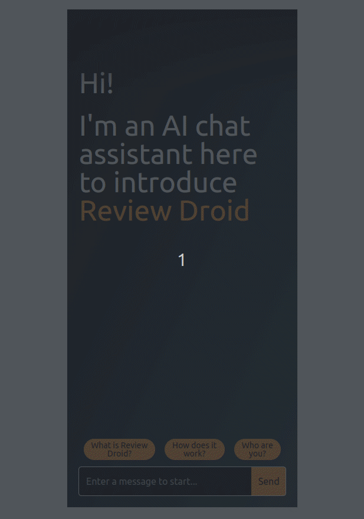

# Landing Page GPT

Who needs landing pages when you can have a chat bot explain your product instead?

## Demo

## Features
- [x] Generate a talented chat bot from a product description and product name
- [x] All infrastructure is managed via Terraform
- [x] All messages and conversations are saved to DynamoDB
- [x] Customers can choose to join a waitlist and submit their email

## Requirements
- An OpenAI API key
- An AWS Account
- [Terraform](https://www.terraform.io/downloads.html)
- [Node.js](https://nodejs.org/en/download/)
- [npm](https://www.npmjs.com/get-npm)

## Getting started
1. Make sure you have an OpenAI API key. You can get one [here](https://beta.openai.com/).
1. Store the API key in your environment variables as `OPENAI_API_KEY`.
1. Have your AWS credentials handy as well, saved as environment variables `AWS_ACCESS_KEY_ID` and `AWS_SECRET_ACCESS_KEY`.
1. Create a Terraform state bucket and replace it in `terraform/main.tf`.
1. Buy a domain name and replace all references to `www.droid-corp.com` with it.
1. Transfer the domain nameservers to AWS Route53.
1. Run `terraform init` and `terraform apply` in the `terraform` directory.

## Architecture
The app is deployed to AWS using Terraform. The infrastructure consists of:
- An AWS lambda function that handles all the logic
- A DynamoDB table to store all messages and conversations
- A `create-react-app` frontend that is deployed to a public-facing S3 bucket

## Deploying the app
Everything you need is in the Makefile.

